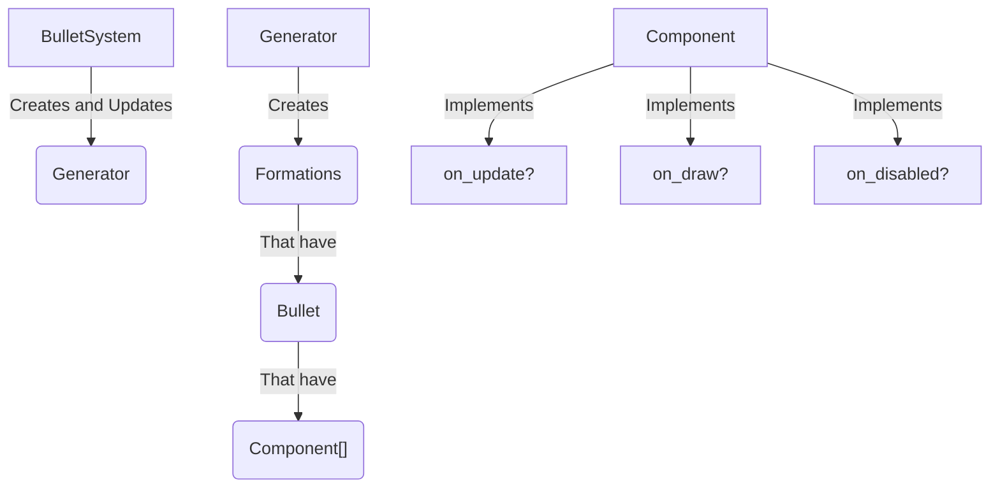

# LÖVEly Bullets System Documentation

This document describes the operation of the bullet system and generators in LÖVE 2D.

## Table of Contents
- [LÖVEly Bullets System Documentation](#lövely-bullets-system-documentation)
  - [Table of Contents](#table-of-contents)
  - [Introduction](#introduction)
- [Rationale](#rationale)
  - [Performance](#performance)
- [Installation](#installation)
- [System Usage](#system-usage)
    - [Custom Generator Example](#custom-generator-example)
  - [Coroutine Parameters](#coroutine-parameters)
  - [Interesting pattern](#interesting-pattern)
  - [API](#api)
    - [Bullet](#bullet)
    - [Generator](#generator)
    - [LOVElyBullets](#lovelybullets)

## Introduction

This system allows the creation and control of bullets in a modular way, facilitating the generation of complex patterns through generators and components. This could also be used as Particle System. And will definitely need modification on your side to handle collision detection. I didn't add that because I have no idea of whether you'll use bump, slick, love.physics... But everything is in place for you to add it.

# Rationale

I wanted to have a system that allowed me to define a great variety of patterns in a modular way. This system might not be as straightforward as others and it has its own quirks. This system is architectured in this way.



First you create a generator that has a coroutine function. That coroutine defines where and when to spawn bullets. Bullets are optionally activated on creation inside the generation function, or you can activate them after a while. You can spawn the bullets of the next formation after or before the bullets of the previous ones are activated. Bullets draw function is called always no matter its active state. You could perfectly make them invisible in that time. I'm not sure how to explain this properly but this system is designed to handle or combinations and timings you can think of.

I would like if this system is useful to people, but I'm sure that I can explain it much better. If you don't undertsand something, please ask me. I'll be happy to help you.

## Performance

In this system I didn't prioritize performance, and yet I can run the 26k bullets (with lifetime, move, and draw_circle) at 60fps. It's not really a lot given we are just iterating and array and changing some values. But it's still good for all it offers and well, if you add physics you won't be able to handle that much entities anyways... I like to think that this system is good enough for most games.

# Installation

Just take the [LOVElyBullets](./LOVElyBullets) folder and put it in your project.

A .vscode folder is included to have everything yuo need to clone the repo and test the system, it includes the lua language server and the love2d extension. You can delete it if you want.

# System Usage

Please check the [main.lua](./main.lua), [component.lua](./components.lua) and [generators](./generators.lua) files for a complete example of how to use the system.


### Custom Generator Example

```lua
local function custom_pattern(radius, count, spawn_point, draw_data)
    local seconds_between = 0.05
    for i = 1, count do
        local angle = (i / count) * math.pi * 2
        local direction = { x = math.cos(angle), y = math.sin(angle) }
             local bullet_position = {
            x = math.cos(angle) * radius + spawn_point.x,
            y = math.sin(angle) * radius + spawn_point.y
        }
        coroutine.yield({
            position = bullet_position,
            components = {
                Components.simulate_parenting(spawn_point, bullet_position),
                Components.lifetime(2),
                Components.move(200, direction),
                Components.draw_circle(draw_data)
            }
        }, seconds_between)
    end

    coroutine.yield(nil, 0.2, 0.5, true)

    coroutine.yield({
        position = { x = spawn_point.x, y = spawn_point.y },
        components = {
            Components.lifetime(2),
            Components.move(200, { x = 0, y = 1 }),
            Components.draw_circle(draw_data)
        }
    })
end
```

This pattern generates a circular formation of bullets and then waits before starting the next one.

But... Where do Components come from? Well, you have to provide it yourself. I don't provide any component but you can check my implementation in the [components.lua](./components.lua) file.

Components are object tha can have 3 functions: `on_update`, `on_draw` and `on_disabled`. `on_draw` is called always (unless the bullet is pooled), `on_update` is called when the bullet is active and `on_disabled` is called when the bullet is disabled.

Here you have a simple example of a component that makes a bullet move in a direction and also draws it as a circle.

```lua
function Components.normal_bullet(speed, direction, draw_data)
    local comp = { draw_data = draw_data or {} }
    
    function comp.on_update(bullet, dt)
        bullet:move_by(direction.x * speed * dt, direction.y * speed * dt)
    end

    function comp.on_draw(bullet)
        love.graphics.setColor(comp.draw_data.colour or { 1, 1, 1 })
        love.graphics.circle("fill", bullet.position.x, bullet.position.y, comp.draw_data.radius or 5)
    end

    return comp
end
```

## Coroutine Parameters

The most confusing part of the system is the coroutine parameters, because their meaning depends on whether the first parameter is nil or not.

- If the fist parameter is not nil, it means that you are generating a bullet. In this case, the parameters are:
    1. **bullet_data (table)**: Data of the bullet to be generated.
    2. **wait_time (number)**: Wait time before generating the next bullet. Optional parameter, defaults to 0.

- If the first parameter is nil, it means that you are generating a new formation. In this case, the parameters are:
    1. **bullet_data (nil)**: This must be nil in this case.
    2. **wait_time (number)**: Wait time before starting the next formation. Optional parameter, defaults to 0.
    3. **enable_time (number)**: Wait time before activating the bullets of the previous formation. Optional parameter, defaults to 0.
    4. **wait_to_enable (boolean)**: If `true`, waits `enable_time` before continuing with the next formation. Optional parameter, defaults to `false`. To make things more clear, when this is false, the next formation will start after `wait_time` seconds even if the previous formation hasn't been enabled yet.

This means that if you do `coroutine.yield()`, the system will interpret that as "current formation ended, I'll inmeadiately enable the bullets and start the next formation".

These three yields mean the same

```lua
coroutine.yield(nil, nil, nil, false)
coroutine.yield()
```

This doesn't get handled the same way internally, but the result is the same

```lua
coroutine.yield(nil, 0.3, 0.5, true)
coroutine.yield(nil, 0.8, 0.5)
```

In the first one, the system waits 0.5 seconds (enable_time) to activate the previous formation, then waits 0.3 seconds (wait_time) to start the next formation. In total it waits 0.8 seconds before starting the next formation. In the second one, the system waits 0.5 seconds (enable_time) to activate the previous formation and at the same time waits 0.8 seconds (wait_time) to start the next formation. In total it waits 0.8 seconds before starting the next formation. But for example if instead of 0.8 seconds it were 0.3, the next formation would start before the bullets of the previous ones are activated.

## Interesting pattern

Let's say you want to create a pattern with 3 formations. But you don't want the first formation to be activated until the last one is activated. How do we handle that with this system? When you want to start a new formation, you always have to give a enable time. But... We can use that in our favor. Just give it a ridiculous high enable time. Then, after your last formation do this.

```lua	
    coroutine.yield(
        {
            position = { x = 0, y = 0 },
            components = {
                Components.lifetime(0),
            },
        },
        2
    )
```
This will create a bullet that do nothing and destroys itself at the moment, but the interseting part is that it pauses the system for 2 seconds. After those 2 seconds, the courtine will end and the system will enable the bullets that were waiting to be enabled, no matter how high the enable time was. This is a trick to make the system wait for the last formation to be activated before starting the first one.

Also note that that component doesn't exist, you have to create it yourself, but you can check my implementation in the [components.lua](./components.lua) file.

You might think "Shouldn't the system wait until all formations are active before finishing?". That's a pretty good question. I just like it this way and it's convenient.

---

## API

Everything in the code is documented with sumneko lua annotations, so you can check the code for more information. Here I list just some properties to give a general overview of the system. Some design decisions are explained in the code itself.

### Bullet
Represents a bullet in the system.

**Properties:**
- `position (table)`: Current position of the bullet
- `spawn_point (table)`: Point from where the entity is being spawned. Aka your entity or generator position. This must be a table reference
- `components (table)`: List of associated components.
- `active (boolean)`: Whether the bullet is active.

**Methods:**
- `Bullet.new(data, system)`: Creates a new bullet instance. You shouldn't call this, use BulletSystem:create_bullet instead.
- `Bullet:update(dt)`: Updates the bullet and its components. If the bullet is not active, it will call the on_disabled method of its components.
- `Bullet:draw()`: Draws the bullet.
- `Bullet:on_spawn()`: If you hooked a callback data, it will be triggered everytime you spawn a bullet
- `Bullet:on_despawn()`: If you hooked a callback data, it will be triggered everytime a bullet is despawned
- `Bullet:move_by(x, y)`: Moves the bullet by the specified amount.
- `Bullet:move_to(x, y)`: Moves the bullet to the specified position.

The move methods are there for when you implement physics, you would move your rigidbody or entity there instad of the bullet position itself.

### Generator
Creates bullet patterns.

**Properties:**
- `bullets (table)`: List of generated bullets.
- `current_formation (table)`: Current bullet formation.
- `pending_formations (table)`: Pending sub-formations.
- `generator_timer (number)`: Controls the wait time between bullets.
- `coroutine (coroutine)`: Generator's coroutine.

**Methods:**
- `Generator.new()`: Creates a new generator instance.
- `Generator:update(dt)`: Updates the bullet generation.
- `Generator:cancel(keep_bullets)`: Cancels the generation. If `keep_bullets` is `true`, the generated bullets will remain and will be activated if they are not already.

### LOVElyBullets
System that manages all bullets and generators.

**Methods:**
- `BulletSystem.new()`: Creates a new system instance.
- `BulletSystem:create_bullet(bullet_data)`: Creates a new bullet.
- `BulletSystem:update(dt)`: Updates the system.
- `BulletSystem:draw()`: Draws all bullets.
- `BulletSystem:remove_bullet(bullet)`: Removes a bullet.
- `BulletSystem:new_generator(func, ...)`: Creates a bullet generator with a generation function. Returns a function that allows to cancel the generation.
